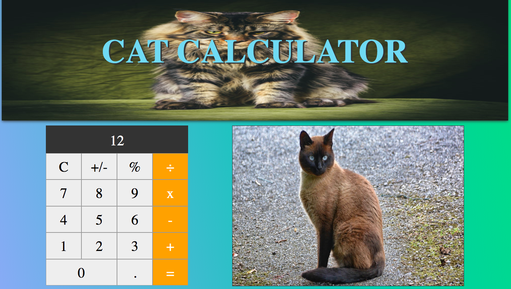
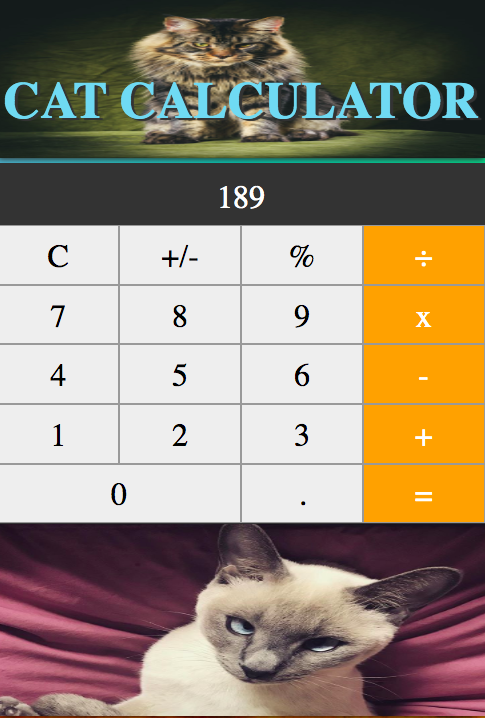

# Cat Calculator

## Table Of Contents

-   [Description](#description)
-   [Stack](#stack)
-   [Final Product](#final-product)
-   [Getting Started](#getting-started)
-   [Dependencies](#dependencies)

## Description

Cat Calculator is an adorably practical responsive full stack application, making solving math problems cuter than ever. Simply enter your operations into the fully functional calculator to render a uniquely calculated cat photo.

## Stack

### Back-End

-   PHP
-   Laravel
-   [The Cat API](https://thecatapi.com/)

### Front-End

-   JavaScript
-   Vue.js
-   Axios

## Final Product




## Getting Started

This project requires a Laravel / PHP environment, if you do not yet have this set up please see these resources to get started:

https://codebriefly.com/basic-laravel-vue-js-setup/

https://programarivm.com/setting-up-a-vue-js-and-laravel-homestead-app-in-seconds/

https://laravel.com/docs/6.x/homestead

After you have the environment setup you can get started with these steps:

1. Clone this repository.

2. Open a terminal and `cd` into the project directory.

3. Install node packages using the `npm install` command in the terminal.

4. Install Laravel dependencies using the `composer install` command in the terminal.

5. Start the web server using the `yarn run watch` command in the terminal.

6. The app will be served at <http://localhost:8000/> in your browser.

## Dependencies

```
axios: ^0.19,
babel-eslint: ^10.0.3,
cross-env: ^5.2.1,
eslint: ^6.8.0,
eslint-config-prettier: ^6.10.0,
eslint-plugin-prettier: ^3.1.2,
eslint-plugin-vue: ^6.1.2,
laravel-mix: ^5.0.1,
lodash: ^4.17.13,
prettier: ^1.19.1,
resolve-url-loader: ^2.3.1,
sass: ^1.15.2,
sass-loader: ^8.0.2,
vue: ^2.6.11,
vue-eslint-parser: ^7.0.0,
vue-template-compiler: ^2.6.11
```
